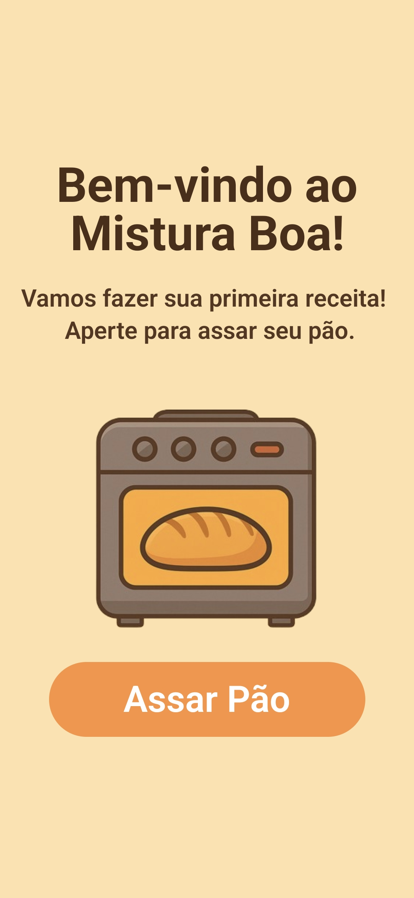
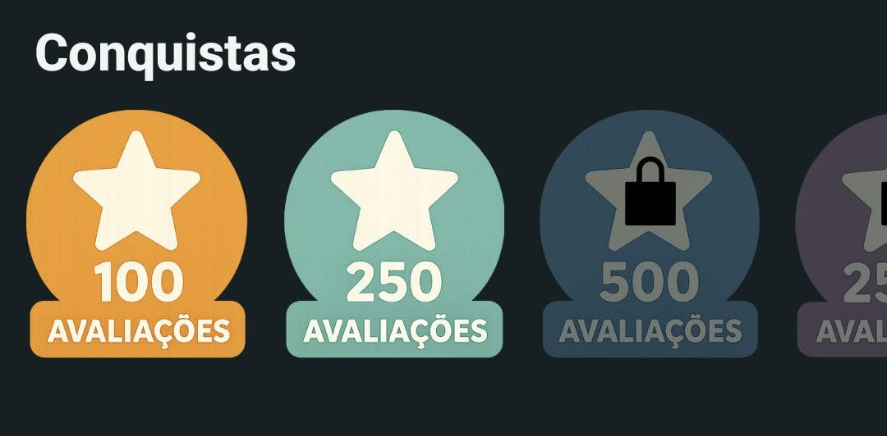
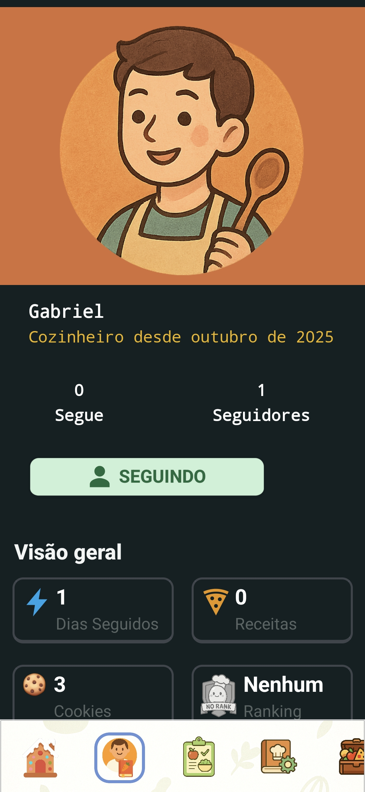
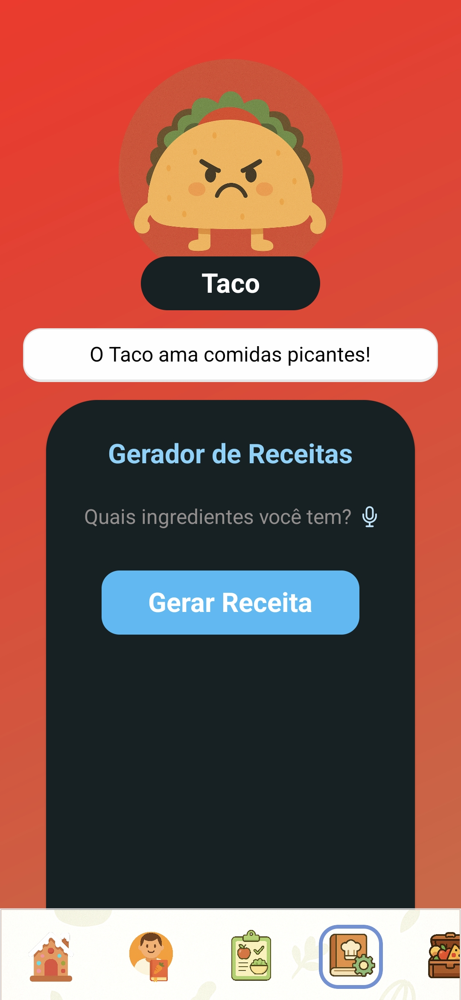
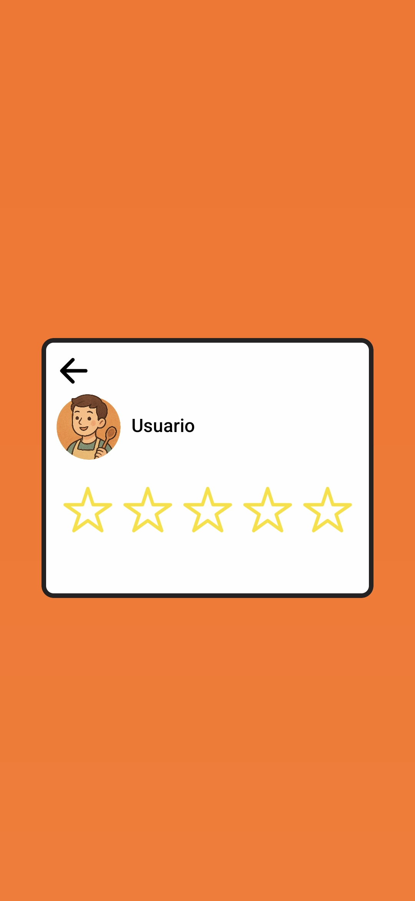

# 🍽️ Mistura Boa — Smart Recipe App
Troque o commit para VersãoPortuguês para ler em português

  

This project is a recipe app built with **React Native**, combining **artificial intelligence**, **Firebase** and **responsive design** to provide a personalized user experience.  
The main goal is to present a scalable architecture, clean code and modern UI practices, serving as a **professional portfolio project**.

---

## Platforms

- **Android** (developed and tested)
- Can be adapted to iOS with small adjustments

---

## Screenshots

### Home and Recipe Details
| Home | Recipes |
|--------|----------|
|  |  |

### Recipe Creation
| Recipe Generator | Create Recipe |
|------------------|---------------|
|  |  |

---

## Features

- 🔐 **Firebase Authentication**
  - Email and password login and registration
  - Profile management with photo and name
- 🧠 **AI Recipe Generator**
  - Generates recipes based on provided ingredients
  - Suggests balanced combinations using generative AI
- 🍴 **AI Diet Generator**
  - Creates personalized meal plans (weight loss, muscle gain, vegetarian, etc.)
  - Generates daily/weekly suggestions with macronutrient estimates
- 🍁 **Long-term App Design**
  - Achievement system and rankings
  - Unlockable user icons
- ☁️ **Integration with Firebase Realtime Database**
  - Stores recipes, favorites and user data in real time
- 🖼️ **Image Upload**
  - Upload and caching of photos in MongoDB
- 💅 **Responsive Design**
  - Styling with **NativeWind** for a modern and adaptive layout

---

## Libraries / Tools

This project uses the following libraries and tools:

- [React Native](https://reactnative.dev/) for the Android app  
- [TypeScript](https://www.typescriptlang.org/) for static typing  
- [Firebase](https://firebase.google.com/) for authentication, database and storage  
- [NativeWind](https://www.nativewind.dev/) for Tailwind-style styling  
- [React Navigation](https://reactnavigation.org/) for navigation   
- [Expo Image Picker](https://docs.expo.dev/versions/latest/sdk/imagepicker/) (optional for image uploads)
- [MongoDb](https://www.mongodb.com/) to store data and images.

---

## Project Structure

All code is located in the `src` directory, organized for scalability and readability.

```
src/
 ├── components/       # Reusable components and Main Screens
 ├── express/          # Dedicated server structure
 ├── navigation/       # Screen navigation 
 ├── reducers/         # Global variables via redux
 └── types/            # Global TypeScript types
```

---

## How to Run the Project

```bash
# Clone the repository
git clone https://github.com/GabrielGrozinski/Mistura-Boa.git

# Enter the directory
cd Mistura-Boa

# Install dependencies
npm install

# Run on Android
npx react-native run-android
```

---

## Project Philosophy

All logic is organized into **hooks** and modular **services**, alongside the **main components**, ensuring separation between UI and data layers.  
This facilitates maintenance, readability and integration with new AI services or backends in the future.

---

## Details of the Start Screens (`src/components/Inicio`)

This folder contains the app's start screens, responsible for the user's entry experience:

- **PrimeiraTela**  
  Welcome screen, visually focused and presenting the app. It has no authentication logic, only UI.
  There is also a loading screen that runs throughout the app.

### First Screen
| Start | Loading |
|-------|---------|
|  |  |

---

- **Login**  
  Authentication screen allowing the user to log in or start registration. Integrates with Firebase for credential validation and with MongoDB to track login days.

### Login and Registration
| Login | Register |
|-------|----------|
|  |  |

---

- **CriarUsuario**  
  Registration screen where the user provides data like diet type, app goal and profile photo. Creates the user in Firebase and prepares the profile for app use.
  Some data allows multiple choices, while others, like diet type, allow only a single choice.

### User Data
| Goal | Knowledge |
|------|-----------|
|  |  |

| Diet | Cuisine |
|------|---------|
|  |  |


| Search | Icon |
|--------|------|
|  |  |

---

## Details of Main Screen (`src/components/TelaPrincipal`)

This folder contains the app's main screen, responsible for the user's core experience:

- **TelaPrincipal**  
  Main screen showing the user's icon, amount of XP (displayed in cookies) and the ability to access specific recipes for Breakfast, Lunch, Dessert and Dinner.
  Below this and most screens there is a bar allowing the user to switch between screens.

### Main Screen
| Main Screen | Lunch | Lunch Completed |
|-------------|-------|-----------------|
|  |  |  |

---

## Details of Profile Screens (`src/components/Perfil`)

This folder contains components related to the profile screen, responsible for showing user profiles and related features.

- **Perfil**  
  Base profile screen showing the user's icon (which they can change with icons that have their own requirements), their name, when the user was created (retrieved from MongoDB), number of followers and following, and an add friends button.
  A bit lower there is an overview container showing consecutive login days, number of recipes created, XP and the user's current ranking.
  Then there are buttons for Favorite Recipes, Achievements and Recipes Created by the user.
  To unlock the Created Recipes button, the user must create at least 3 recipes.
  All information is dynamic and changes as the user uses the app.

### Profile Screen
| Profile 1/2 | Profile 2/2 |
|------------|------------|
|  |  |

---

### Icons Screen
| Icons 1/2 | Icons 2/2 |
|----------|-----------|
|  |  |

---

### Poseidon Icon
| Poseidon 1/2 | Poseidon 2/2 |
|--------------|--------------|
|  |  |

---

### Achievements Screen
| Achievements 1/2 | Achievements 2/2 |
|------------------|------------------|
|  |  |

---

### Created Recipes Screen
| Created Recipes |
|-----------------|
|  |

---

- **Add Friends** 
  The add friends screen is accessed by clicking the followers/following numbers or the add friends button.
  If clicked on following/followers, it shows who that user follows and who follows them.
  It's possible to follow a user from this screen, and to access a user's profile and follow them from there.
  There are 4 possible states for the add friends button: original, follow, following and follow back.

### Add Friends
| Users to Follow |
|-----------------|
|  |

| Following: 0 | Followers: 0 |
|-------------|--------------|
|  |  |

| Following: 1 | Followers: 1 |
|-------------|---------------|
|  |  |

| Follow | Following |
|--------|----------|
|  |  |

| Add Friends | Follow Back |
|-------------|-------------|
|  |  |

---

- **Ranking** 
  The ranking screen shows all app rankings: NoRank (initial ranking), Bronze, Gold, Diamond, Emerald and Supreme Chef.
  Each ranking has its own requirements and they are dynamic, so they grow as users complete them.
  The user's current ranking is shown at the top of the screen.

### Ranking
| Ranking 1/6 | Ranking 2/6 |
|-------------|-------------|
|  |  |

| Ranking 3/6 | Ranking 4/6 |
|-------------|-------------|
|  |  |

| Ranking 5/6 | Ranking 6/6 |
|-------------|-------------|
|  |  |

---

## Details of Fitness Screens (`src/components/Fitness`)

This folder contains screens related to the app's diet logic, useful in current contexts.

- **Dieta**  
  Base screen showing the user's diets (if any), and offering the option to create more.

### Diet Screen
| No Diet | With Diet |
|---------|-----------|
|  |  |

---

- **CriarDieta**  
  Diet creation screen where the user selects options such as diet goal, weight, height, restrictions and daily budget, and an AI would generate the diet.

  ### Diet Creation
| Goal | Weight |
|------|--------|
|  |  |

| Height | Restrictions |
|--------|--------------|
|  |  | 

| Price |
|-------|
|  |

---

- **DietaCriada**  
  The created diet screen where the user's provided data is recorded.
  It includes 4 meals with macronutrient amounts for each.
  There are also 4 meals for each day of the week.
  **NOTE: this screen was not finished. It's only a prototype because I didn't fully integrate the AI into my code, but conceptually that's how it would work.**

### Created Diet
| Ready Diet |
|------------|
|  |

---

## Details of Recipe Generator Screens (`src/components/GeraReceita`)

This folder contains two screens: one for manual recipe creation and one for AI-generated recipes.

- **GeradorReceita**  
  Screen for generating recipes with AI. You can switch between three "chefs" (different personalities): Hamburgão, Moranguinho and Taco.

### Recipe Generator
| Hamburgão | Moranguinho |
|-----------|-------------|
|  |  |

| Taco | Chef Selection |
|------|----------------|
|  |  |

---

- **CriaReceita**  
  Screen to create recipes manually.
  Recipes require: Image, Title, Description, Difficulty, Time, Recipe Steps, Recipe Ingredients, Recipe Type and Meal.
  Some options are free text, others are selectable from predefined options.
  Text fields like description have character limits.
  Each created recipe behaves exactly like the app's base recipes and includes all functionality.

### Recipe Creator
| Create Recipe 1/2 | Create Recipe 2/2 |
|-------------------|--------------------|
|  |  |

| Select Image | Selected Image |
|--------------|----------------|
|  |  |

| Description 1/6 | Description 2/6 |
|-----------------|-----------------|
|  |  |

| Description 3/6 | Description 4/6 |
|-----------------|-----------------|
|  |  |

| Description 5/6 | Description 6/6 |
|-----------------|-----------------|
|  |  |

| Recipe Steps |
|--------------|
|  |

| Recipe Ingredients | Ingredient Measurements |
|--------------------|-------------------------|
|  |  |

| Difficulty | Time |
|------------|------|
|  |  |

| Meal | Recipe Type |
|------|-------------|
|  |  |

| Created Recipe | Rating Created Recipe |
|----------------|-----------------------|
|  |  |

| Created Recipe Before Favoriting  | After Favoriting |
|-----------------------------------|------------------|
|  |  |

---

## Details of Recipe Screens (`src/components/Telas_de_Receitas`)

This folder contains all recipe-related logic: categorization, filtering and the recipe screen itself.

- **App and User Recipes**  
  Recipes are separated into Carnivorous (app), Carnivorous (users), Vegan (app), Vegan (users), Vegetarian (app) and Vegetarian (users).
  There's also an indicator of the user's chosen diet type since registration.

### Main Recipes
| Carnivore | Vegetarian | Vegan |
|-----------|-----------|------|
|  |  |  |

---

- **Base Recipes**  
  There are 6 Base Recipe screens. Conceptually each would have its own recipes and dynamics, allowing special sections (e.g., holiday recipes or sea-themed recipes for a Poseidon character).

### Carnivore Base Recipe
| Base Recipe |
|-------------|
|  |

---

- **Carnivore, Vegan and Vegetarian Recipes**  
  All recipes are separated by carnivore, vegan and vegetarian.
  You can filter recipes by goals like lose weight, gain muscle; by difficulty, speed and calories.
  Filters can also be by Breakfast, Main Dish (lunch and dinner), Dessert and Drink.
  Filters are dynamic and work across recipes.
  Favoriting recipes is supported.

### Recipes
| Carnivore Recipes | Filter | Vegetarian Recipes | Vegan Recipes |
|-------------------|--------|--------------------|---------------|
|  |  |  |  |

---

### Favorite Recipes
| Favorite Recipe | Favorite Recipes 1/2 | Favorite Recipes 2/2 | Favorite Recipes Filtered |
|-----------------|----------------------|----------------------|---------------------------|
|  |  |  |  |

---

### Created Recipes
| Created Recipes 1/2 | Created Recipes 2/2 |
|---------------------|---------------------|
|  |  |

---

- **Recipe**  
  The recipe screen has many mechanics.
  From top to bottom: recipe image, title, author, preparation time and rating.
  Then ingredients and steps.
  Below steps there is a timer (with the recipe's time) that the user can use; it can be paused.
  At the bottom are comments and ratings, plus a button to mark the recipe as completed.
  Comments are available only to users with at least Bronze rank.
  Users can rate or comment and rate the recipe.

### Recipe
| Recipe 1/2 | Recipe 2/2 |
|------------|------------|
|  |  |

---

### Timer
| Timer Pause | Timer Resume |
|-------------|--------------|
|  |  |

---

### Complete Recipe
| Complete Recipe | Recipe Completed |
|-----------------|------------------|
|  |  |

---

### Comments and Ratings
| Comments | Ratings | Comments without Rank |
|----------|---------|-----------------------|
|  |  |  |

| Rate Recipe 1/2 | Rate Recipe 2/2 | Rated Recipe |
|-----------------|-----------------|--------------|
|  |  |  |

| Write Comment | Recipe with Comment |
|---------------|---------------------|
|  |  |

---

## Monetization

Since this is a portfolio app, it wasn't monetized, but here are some ideas to monetize it.

- **Ads:** simple and practical but may give an unprofessional impression. In this app, ads could be carefully integrated—for example, in the AI recipe generator: when the user clicks to generate a recipe, show an ad while the AI takes a few seconds to generate the recipe.
- **Subscription:** common and practical. The Poseidon character could be subscription-only. Subscriptions could offer benefits: more XP, more recipes created per day, exclusive recipes for subscribers, characters, seasonal passes, more generator characters and featured placement for created recipes.

Overall, I tried to adapt live-service product logic. The idea is to keep the user engaged by creating objectives and rewards. The user is motivated to log in daily for prizes; to create difficult recipes for rewards; to earn XP to unlock characters. Monetization focuses on subscriptions and microtransactions (e.g., purchasable characters). Balance is necessary so subscribers feel advantaged while non-subscribers aren’t frustrated.

---

## Extra Features

Below are some features not in the app but that could be added. They show my vision for improving and monetizing the app.

### Loading

The app has a loading screen used across the app.
Originally the loading screen has a single image variation (truck moving) and different text variations.
It’s possible to create exclusive loading screens (e.g., a Poseidon loading screen that appears only when using Poseidon).

| Poseidon | Santa | Ghost |
|----------|-------|-------|
|  |  |  |

---

### Events

Events drive engagement. In MisturaBoa, events could highlight specific recipes like spicy recipes, 24-hour recipes, best recipes of the year, etc.

| Events |
|--------|
|  |

---

### Festive Recipes

Holiday recipes could boost app activity during Christmas, Halloween, Easter and other times, increasing users and potential subscribers.

| Halloween & Christmas |
|-----------------------|
|  |

---

### Exclusive Recipes

Exclusive recipes increase user interest. Each character (especially hard-to-unlock ones) could have exclusive recipes, and some characters could be subscription-only or purchasable.

| Poseidon & Dragon |
|-------------------|
|  |

---

### Legendary Recipes

A special "Book" with "Legendary Recipes" could exist. Recipes could be selected via monthly/yearly events and top-rated recipes included. Subscribers might be allowed more entries into competitions.

| Legendary Recipes |
|-------------------|
|  |

---

### Ranking System

The ranking system is implemented, but rewards could be expanded.
Examples:
- **Gold:** can create and generate one extra recipe per day.
- **Diamond:** 1.5x XP gain.
- **Emerald:** recipes get highlighted.
- **Supreme Chef:** unlocks exclusive recipes and characters.

| NoRank | Bronze |
|--------|--------|
|  |  |

| Gold | Diamond |
|------|---------|
|  |  |

| Emerald | Supreme Chef |
|---------|--------------|
|  |  |

---

### Challenge/Recipe Tree

A challenge tree like Duolingo could be added where users complete specific recipes (historical or iconic recipes) leading to a final recipe. This increases engagement and gives progression.

| Duolingo Tree | Recipe Tree Example |
|---------------|---------------------|
|  |  |

---

### Cooking Courses

Cooking courses would be a great addition for subscribers, improving recipe quality and increasing revenue.

---

### Energy System

An energy system limits how much users can use features each day, encouraging return visits and monetization (e.g., subscriptions to increase energy).
This mechanic could apply to creation/generation of recipes, completing recipes, and many other features.

| Energy System Example |
|-----------------------|
|  |

---

## 📬 Contact

Feel free to reach out for questions, suggestions or professional opportunities!

- **LinkedIn:** [LinkedIn](https://www.linkedin.com/in/gabriel-grozinski/)
- **E-mail:** gabrielgrozinski@gmail.com

---

Thanks for visiting my project!  
I’m open to feedback and collaboration opportunities.

---

## Note

**All files include their own annotations, and at the bottom there is a general note describing the component, possible improvements, future ideas, reasons for certain code choices, etc.**
